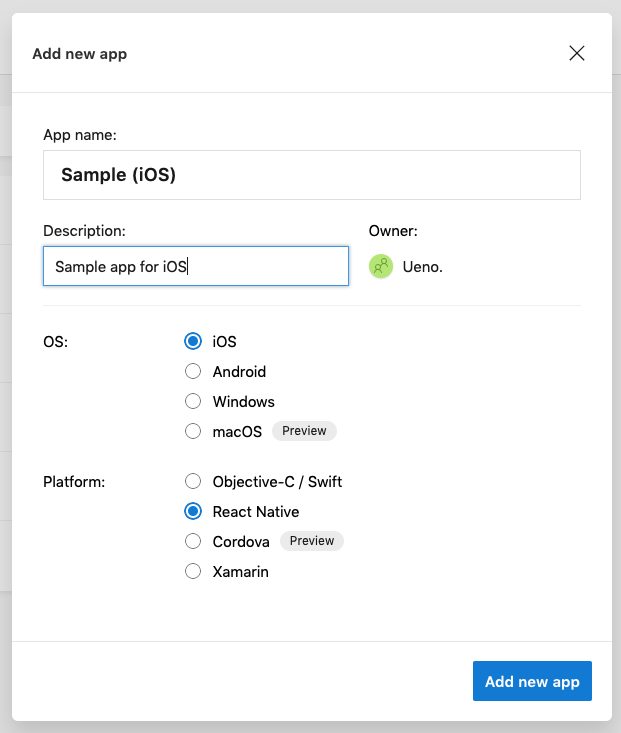
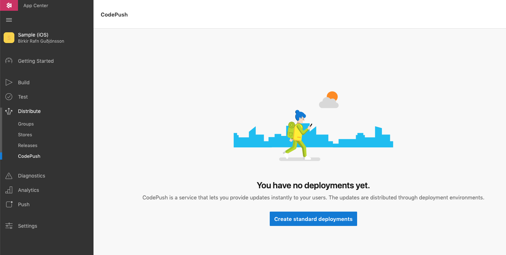
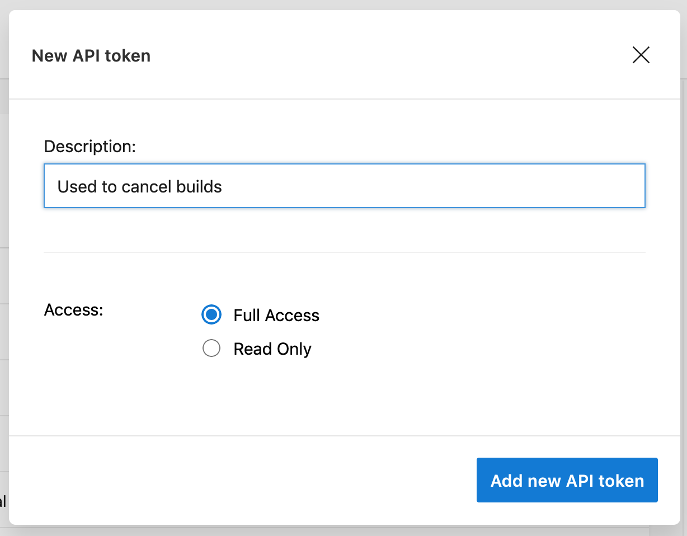
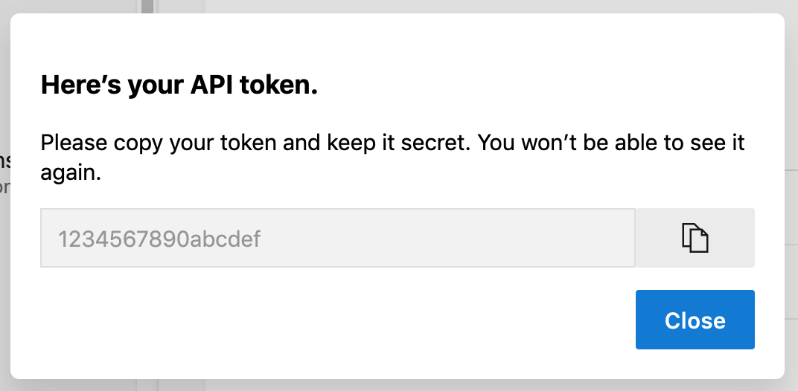
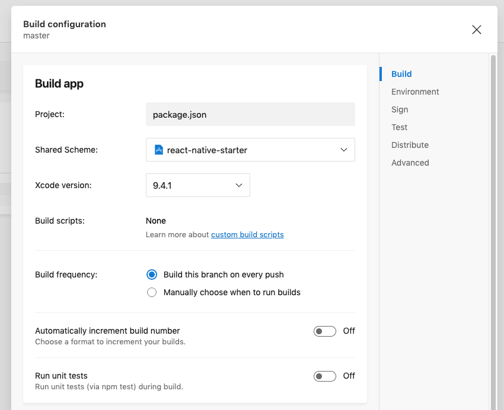
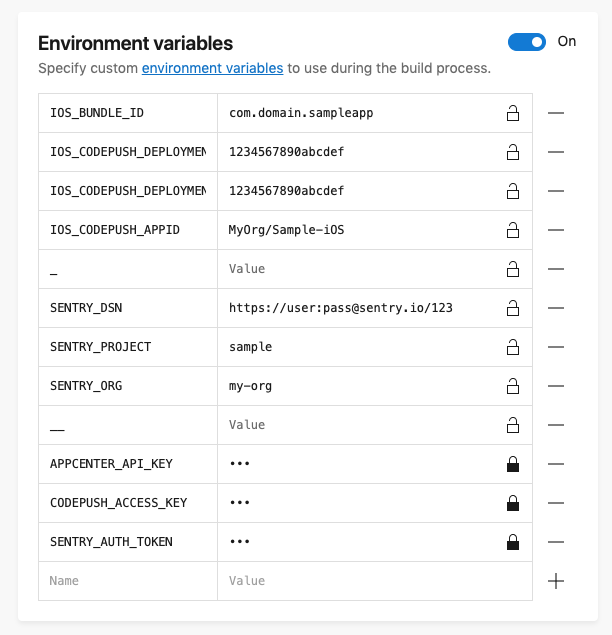
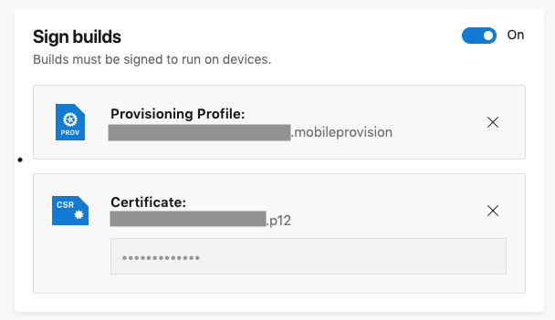
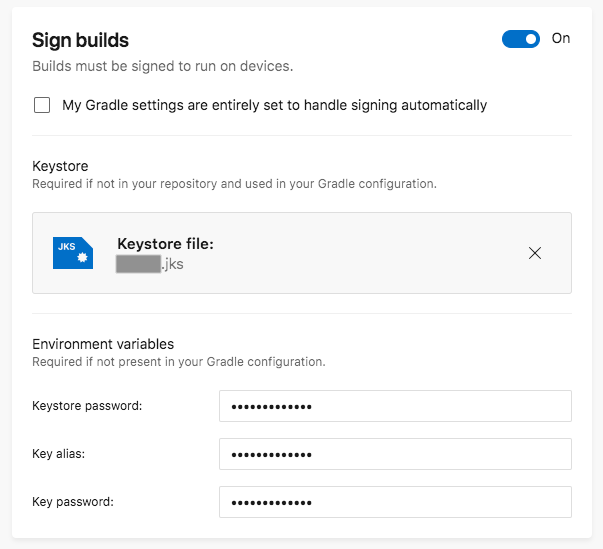
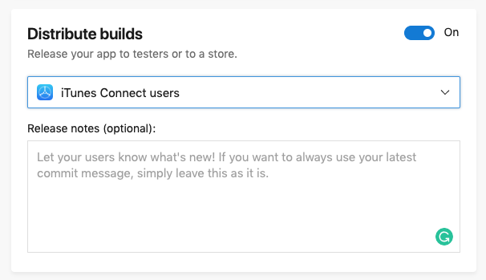

# Publishing

Publishing is probably the most complicated thing about app development. We have made sure to have everything ready and approvable by the app stores using App Center and Continous Delivery.

**Requirements**

You will need to first go through the [Sentry's step by step](/SERVICES.md?id=sentry) to get the differents keys.

## Overview

Here is how the CI works:


The pipeline to continously deliver the app are two separate processes integrated into one. Commit changes are detected in `./android` and `./ios` folder that will make native builds automatically.

New builds will also be triggered via commit message tags `[BUILD]` for both or explicitly `[BUILD IOS]` and `[BUILD ANDROID]`.

?> Every task listed above is conditionally executed based on other task actions. It will for example not deploy a code-push update for android if a native android build was done (and same for iOS).

## Configure iOS or Android

### 1. Add a new App

For example `"Sample (iOS/Android)"`, select `iOS/Android` for the OS and `React Native` for the Platform.



### 2. Create a CodePush deployment configuration

Go to **Distribute** > **CodePush** and hit the `"Create standard deployments"` button.



### 3. Get your keys

Go in your terminal and type

```bash
$ code-push deployment ls MyOrg/Sample-(iOS/Android) -k
```

You will get this table
```bash
┌────────────┬──────────────────┬─────────────────────┬──────────────────────┐
│ Name       │ Deployment Key   │ Update Metadata     │ Install Metrics      │
├────────────┼──────────────────┼─────────────────────┼──────────────────────┤
│ Production │ 1234567890abcdef │ No updates released │ No installs recorded │
├────────────┼──────────────────┼─────────────────────┼──────────────────────┤
│ Staging    │ 1234567890abcdef │ No updates released │ No installs recorded │
└────────────┴──────────────────┴─────────────────────┴──────────────────────┘
```

By running you will get your `CODEPUSH_ACCESS_KEY`

```bash
code-push access-key add Sample-(iOS/Android)
```

### 4. Get an App Center API Token

Go to **Your Name** in the lower left corner of the screen and hit **Account Settings**. Then click **API Tokens** in the left menu and there should be a button called `New API token`.



Make sure to store this token safely. You will be using it twice, once for each platform. It will disappear once you close this dialog:



### 5. Insert all your environment variables

With the [Sentry's step by step](/SERVICES.md?id=sentry) and the steps 3 and 5 you will be able to have all the necessary variables and add them to your `.env` file.

```bash
# iOS specific variables
IOS_BUNDLE_ID=
IOS_CODEPUSH_DEPLOYMENT_KEY=
IOS_CODEPUSH_DEPLOYMENT_KEY_STAGING=
IOS_CODEPUSH_APPID=

# Android specific variables
IOS_BUNDLE_ID=
IOS_CODEPUSH_DEPLOYMENT_KEY=
IOS_CODEPUSH_DEPLOYMENT_KEY_STAGING=
IOS_CODEPUSH_APPID=

# This can be shared between iOS and Android
SENTRY_DSN=
SENTRY_PROJECT=
SENTRY_ORG=

# Secret variables (also shared)
APPCENTER_API_KEY=
CODEPUSH_ACCESS_KEY=
SENTRY_AUTH_TOKEN=
```

?> `MyOrg/Sample-(iOS/Android)` is the `CODEPUSH_APPID`, `com.ueno.reactnativestarter` is the default `BUNDLE_ID` (it changed since you ran the `yarn rename` script).

### 6. Configure App Center

Go to **Build** in the sidebar, select your branch for example **master** and click the gear icon in the top right corner.

Change the **Shared Scheme** to `react-native-starter` (or the name of your scheme), do not select *build-env*. Make sure you turn off **Automatically increment build number**. It is recommended to run the tests before each build, but I left it as optional.



Copy/paste all the variables that you generated and you have in your `.env` file.



### 7. Signing builds

To be able to deploy on both iOS and Android, you need to sign your builds. It requires to generated 2 files for iOS and 1 file for Android

Follow these two guides to get the files

**iOS:** https://docs.microsoft.com/en-us/appcenter/build/ios/uploading-signing-files



**Android:** https://docs.microsoft.com/en-us/appcenter/build/android/code-signing



### 8. Configure your distribution

There are basicly two options available

**Distribute to AppCenter groups**

This requires less waiting time, but more work is involved for the testers. They will have to create an account through App Center to get the app updates

**Distribute to a Store**

This is the recommended method, distribute straight to iTunes Connect users is the fastest way to test your app. You can also choose your own TestFlight group or distribute to the production Store if you will.


